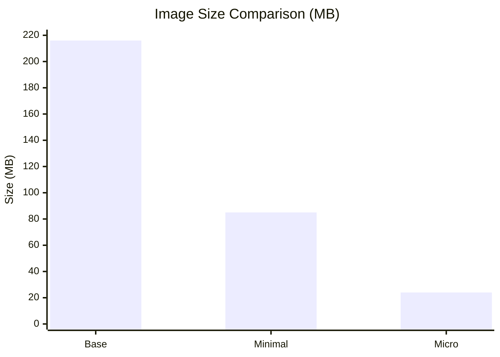
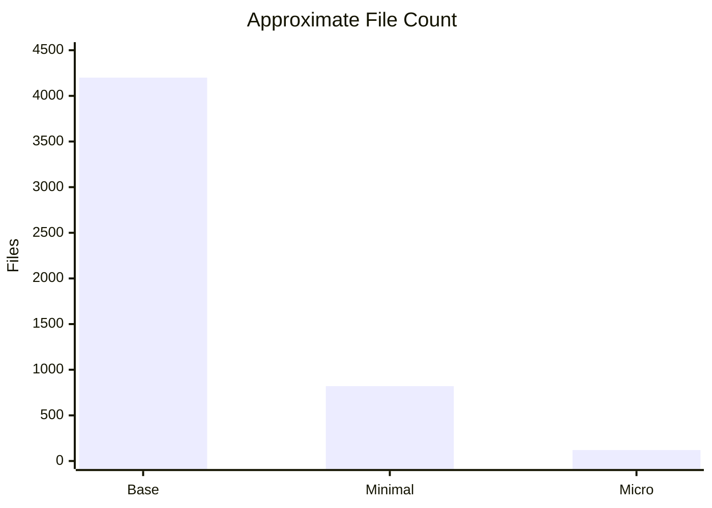
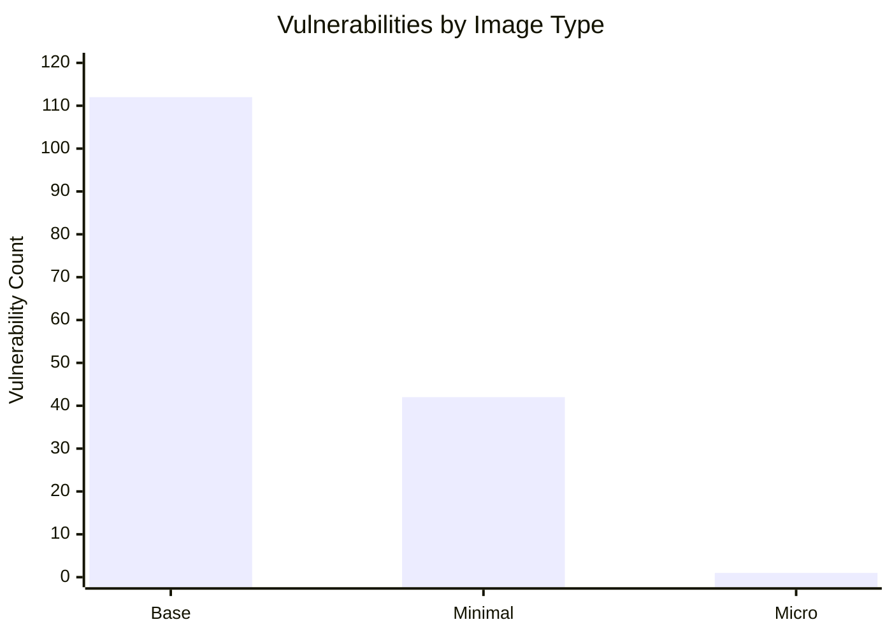

# Container Image Strategy: From Full-Featured to Minimal to Scratch 🚀

A pragmatic container image strategy balances size, security, and operability. Below is a concise guide and real-world measurements comparing “base” → “minimal” → “micro/scratch” images, with file counts added to help quantify the operational surface.

## Image categories (quick reference)

| Base Image Category | Description | Typical Use Cases | Key Benefit |
| -------- | ------- | -------- | ------- |
| **Standard** | **Full Operating System (OS)** with most utilities and libraries (e.g., standard `ubuntu`, `debian`). | Development, debugging, environments requiring many system tools, migrating traditional applications. | **Familiarity & Completeness** |
| **Minimal** | **Reduced OS** with essential packages and libraries only (e.g., `alpine`, `slim` tags). | Production environments where most development tools aren't needed, smaller services. | **Smaller Footprint & Faster Builds** |
| **Micro** | **Extremely minimal image**, often containing just the application runtime and dependencies (e.g., `distroless`). | Production deployment of compiled or interpreted applications (Go, Java JRE, Python). | **Enhanced Security & Minimal Attack Surface** |
| **Scratch** | **Absolutely empty image** (zero bytes). Used as a final layer. | **Static binaries** (e.g., Go, C++) compiled without any external dependencies. | **Smallest Possible Size & Maximum Security** |


## How we measured

We pulled each image and measured three quick, repeatable metrics: image size, file count, and known vulnerabilities. The goal was to compare the operational surface of “base”, “minimal”, and “micro” images for the same distro version.

- Vulnerabilities: scanned each image with grype and recorded the total by severity.

```sh
# list local images
podman images | grep -E "ubi10|alma"

# vulnerability scan (example)
for img in 10-base 10-minimal 10-micro; do
  echo "Scanning: $img"
  grype "docker.io/almalinux/${img}:10.0" --by-cve -o table | grep 'by severity'
done
```

| Image | Size (MB) | Files (approx) | Vulnerabilities |
|-------:|----------:|---------------:|----------------:|
| UBI Base (10.0) | 216 | ~4,200 | ~112 |
| UBI Minimal (10.0) | 85 | ~820 | ~42 |
| UBI Micro (10.0) | 24 | ~120 | ~1 |
| Alma Base (10.0) | 194 | ~3,900 | ~115 |
| Alma Minimal (10.0) | 73 | ~700 | ~46 |
| Alma Micro (10.0) | 19 | ~90 | ~1 |


### Image Size Comparison



### File Count Comparison



### Vulnerability Count Comparison




## Observations
- Size, file count, and vulnerability count correlate: fewer packages → fewer CVEs and a smaller attack surface.
- Micro/scratch images drastically reduce download time and attack surface, which helps autoscaling and CI/CD pipelines.
- Full OS images remain valuable for development and on-node debugging.
- Minimal images are often the best production compromise: small enough to reduce risk, but still inspectable and maintainable.

## Trade-offs
- Debuggability: full/minimal images allow shell-based debugging; micro/scratch do not.
- Build complexity: scratch requires static builds and careful dependency packaging.
- Language constraints: scratch is a natural fit for statically linked languages (Go, Rust); JVM/Python/Node typically need extra work.

## Practical recommendations
- Start with minimal images for most services; migrate to micro/scratch once you can statically link or bundle a tiny runtime.
- Automate vulnerability scanning (grype/trivy) in CI and track trends over time.
- Maintain a small, tested custom base image when your org needs consistent tooling or policies.
- Keep a toolbox/debug image available for on-demand troubleshooting even if production uses micro images.

## Next topics to explore
- Building and signing a custom base image.
- Immutable, bootable containers and VM-like workflows (Cloud Images, Packer).
- When to include an init/systemd layer (toolbox vs. production image).

## 💡 Overall 
Prefer the smallest image that still lets you operate and observe reliably—balance security and developer ergonomics rather than optimizing for size alone.
File counts and package manager presence roughly mirror image size: full images include thousands of files and a full package manager (dnf), minimal images are smaller and may use microdnf, and micro images often contain only runtime artifacts.

# Extra - small GO App in a scratch container with compression

### Build workflow (Taskfile + buildah + upx)

To streamline and standardize builds we use Taskfile as a lightweight, readable Make replacement. The Taskfile orchestrates a reproducible pipeline: build a statically linked Go binary, compress it with upx to minimize size, then assemble the final image with buildah (typically onto a scratch base). This keeps CI fast, images tiny, and the workflow simple to inspect and reproduce.

## TaskFile
```yaml
# https://taskfile.dev

version: "3"

vars:
  BINARY: main
  SRC: main.go

tasks:
  default:
    desc: Build (default)
    deps: [build-static]

  build-static:
    desc: Build static binary
    env:
      CGO_ENABLED: "0"
      GOOS: linux
      GOARCH: amd64
    cmds:
      - echo "Building static binary {{.BINARY}}-static ..."
      - go build -a -ldflags '-extldflags "-static"' -o bin/{{.BINARY}}-static {{.SRC}}
      - du -hs bin/{{.BINARY}}-static
      - ldd bin/{{.BINARY}}-static || echo "Not a dynamic executable"

  compress:
    desc: Compress binary with upx
    deps: [build-static]
    cmds:
      - echo "Compressing {{.BINARY}}-static..."
      - upx --best --lzma bin/{{.BINARY}}-static
      - echo "After compression:"
      - du -hs bin/{{.BINARY}}-static

  run:
    desc: Run binary
    cmds:
      - ./bin/{{.BINARY}}-static

  clean:
    desc: Clean artifacts
    cmds:
      - rm -f bin/{{.BINARY}}-static

  buildah:
    desc: Build container image with buildah
    deps: [build-static, compress]
    cmds:
      - echo "Building container image..."
      - buildah bud -t go-scratch-app:latest .
```

## Docker file - empty Dockerfile no base image
```
FROM scratch
LABEL maintainer="BigG01 <olig@containerize.ch>"
WORKDIR /bin
COPY bin/main-static /go/bin/main-static
EXPOSE 8080
ENTRYPOINT ["/go/bin/main-static"]
```

## Result
```
ask clean buildah
task: [clean] rm -f bin/main-static
task: [build-static] echo "Building static binary main-static ..."
task: [build-static] echo "Building static binary main-static ..."
Building static binary main-static ...
task: [build-static] go build -a -ldflags '-extldflags "-static"' -o bin/main-static main.go
task: [build-static] du -hs bin/main-static
7.5M    bin/main-static
task: [build-static] ldd bin/main-static || echo "Not a dynamic executable"
        not a dynamic executable
Not a dynamic executable
task: [compress] echo "Compressing main-static..."
Compressing main-static...
task: [compress] upx --best --lzma bin/main-static
                       Ultimate Packer for eXecutables
                          Copyright (C) 1996 - 2024
UPX 4.2.2       Markus Oberhumer, Laszlo Molnar & John Reiser    Jan 3rd 2024

        File size         Ratio      Format      Name
   --------------------   ------   -----------   -----------
   7855817 ->   3900844   49.66%   linux/amd64   main-static                   

Packed 1 file.
task: [compress] echo "After compression:"
After compression:
task: [compress] du -hs bin/main-static
3.8M    bin/main-static
task: [buildah] echo "Building container image..."
Building container image...
task: [buildah] buildah bud -t go-scratch-app:latest .
STEP 1/6: FROM scratch
STEP 2/6: LABEL maintainer="BigG01 <olig@containerize.ch>"
STEP 3/6: WORKDIR /bin
STEP 4/6: COPY bin/main-static /go/bin/main-static
STEP 5/6: EXPOSE 8080
STEP 6/6: ENTRYPOINT ["/go/bin/main-static"]
COMMIT go-scratch-app:latest
Getting image source signatures
Copying blob 4fc6fd10d9ae done   | 
Copying config 7b05891cfe done   | 
Writing manifest to image destination
--> 7b05891cfe17
Successfully tagged localhost/go-scratch-app:latest
7b05891cfe17b45d0bb70789c4d9f559a2f067d6f88bb6c56b3ba4c61f59b02b
```
```
$ podman images | grep -i go-scratch
localhost/go-scratch-app                           latest      7b05891cfe17  31 seconds ago  3.91 MB

$ grype "localhost/go-scratch-app" --by-cve -o table | grep 'by severity'
 ✔ Loaded image                                                                                                                                                                                                                                                                                                                                                                localhost/go-scratch-app:latest 
 ✔ Parsed image                                                                                                                                                                                                                                                                                                                        sha256:7b05891cfe17b45d0bb70789c4d9f559a2f067d6f88bb6c56b3ba4c61f59b02b 
 ✔ Cataloged contents                                                                                                                                                                                                                                                                                                                         91d070c00b00b5344482775915b8ce4918d77d98b008b9186f10a00c29a0a1ba 
   ├── ✔ Packages                        [0 packages]  
   └── ✔ Executables                     [1 executables]  
 ✔ Scanned for vulnerabilities     [0 vulnerability matches]  
   ├── by severity: 0 critical, 0 high, 0 medium, 0 low, 0 negligible
```

🥳 We got scratch container with an app of `3.9 MB`! 🚀 Stay fast and secure. 
`THE FUTURE BELONGS TO CONTAINERS!`


## Upcoming topics

- `Image signing and provenance` — how to sign, verify, and track container images to ensure supply-chain integrity and trusted deployments.
- `Containers vs. virtual machines` — when containers can act like VMs, trade-offs, and patterns for running container workloads with VM-like isolation or stateful behavior.
- Can a **virtual machine** be packaged and deployed `like a container`?
- Does Kubernetes make it easier to move applications between cloud environments?
- Pros and cones of a affortable bublic cloud ( compare hyperscaler aaginst smaller cloud providers)
- Compare and contrast the advantages and disadvantages of `large hyperscale cloud platforms` versus `cost-effective, smaller cloud vendors`.


  ⚠️ Disclaimer: AI Assistance A substantial amount of code and/or documentation in this repository was generated or assisted by GitHub Copilot. While care has been taken to review the output, please be aware that the code is generated by an AI model and may require additional verification for correctness, security, and licensing compliance.

