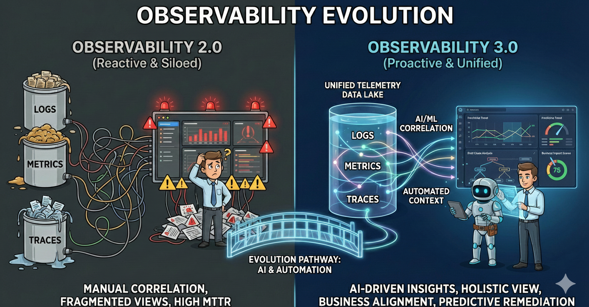

# Observability 1 2 3: coming from reactive to proactive and unified 📊📈🔎

## Introduction

Modern distributed systems have outgrown traditional monitoring. Teams face alert fatigue, slow incident resolution, and inability to predict failures—costing revenue and customer trust.

This article explores observability's evolution from reactive monitoring (1.0) to intelligent, autonomous systems (3.0), examining how AIOps maturity and SRE Agents deliver operational excellence and measurable business value.

## A brief review of previous observability models

### Comparison Table: Observability  and key diffrences

| Version | Era | Key Characteristics | Capabilities | Limitations/Strengths |
|---------|-----|---------------------|--------------|----------------------|
| **Observability 1.0** | Traditional Monitoring | Predefined dashboards and threshold-based alerts | Only see what you thought to measure in advance | Difficult to diagnose unexpected issues in production |
| **Observability 2.0** | Three Pillars Approach | Metrics, logs, and traces together | Better correlation between different data types, trace requests across distributed microservices | Enabled better diagnosis across microservices architectures |
| **Observability 3.0** | Modern Intelligent Approach | AI/ML-assisted with automatic analysis | Anomaly detection, automatic root cause analysis, high-cardinality data queries without performance penalties | Designed for cloud-native, ephemeral infrastructure complexity where traditional approaches fail |

## Let's observe AIOps Adaptation Levels

| Level | Name | Key Capabilities | Impact |
|-------|------|------------------|--------|
| **Level 0** | No AI Integration (Traditional) | Manual incident detection, human-only analysis, fixed runbooks | High MTTR, alert fatigue, reactive response |
| **Level 1** | Detection | Anomaly detection, smart alerting, baseline learning | 30-40% reduction in false positives, faster issue detection |
| **Level 2** |  Correlation | Automatic correlation, probable root cause, impact analysis, pattern recognition | 50-60% reduction in MTTR, contextual insights accelerate troubleshooting |
| **Level 3** | Prediction & Prevention | Predictive alerts, capacity planning, degradation detection, proactive recommendations | 40-50% reduction in incidents, shift from reactive to proactive |
| **Level 4** | Autonomous Incident Response | Self-healing systems, auto-remediation, adaptive learning, natural language interface, closed-loop automation | 70-80% reduction in manual interventions, minimal human involvement for routine issues |
| **Level 5** | Cognitive Observability (Emerging) | Business context awareness, multi-system orchestration, explainable AI, continuous optimization, collaborative intelligence | Transforms observability into a strategic business enabler, not just an operational tool |

## Observability 3.0 + SRE Agent

### What is an SRE Agent?

An SRE Agent is an AI-powered autonomous system designed to handle operational tasks traditionally performed by Site Reliability Engineers. It combines machine learning, automation frameworks, and domain expertise to monitor, analyze, and remediate issues in production environments.

SRE Agents enhance Observability 3.0 platforms by:

- **Closing the Loop**: Moving from observation to action automatically
- **Reducing Toil**: Eliminating repetitive manual operational tasks
- **Accelerating MTTR**: Responding to incidents in seconds instead of minutes
- **Knowledge Retention**: Capturing and codifying operational expertise
- **24/7 Coverage**: Providing consistent incident response without human fatigue

## Key Takeaways

* Key Point 1 💡 - The transition from `reactive` monitoring to `proactive`, `autonomous operations` is a strategic business imperative that directly impacts profitability and competitiveness.

* Key Point 2  💡 - Everyone `aims` for the proactive insights of `Level 3`, but in practice, the majority of the industry is still stuck in the reactive phases of `Level 0` and `1`.

* Key Point 3 💡 - **Engineers focus on features, not 🔥firefighting**

(picture by GEMINI)