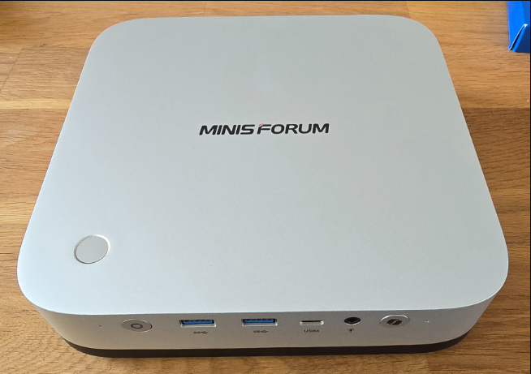
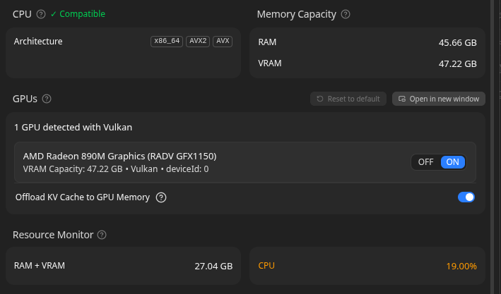
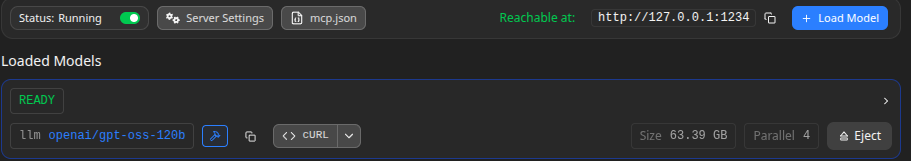

# 🤖 Running a 120B Model in My Home Lab

At home I have a small lab where I try out things before I use them at work. When the new AMD AI chips came out I wanted to test if it is really possible to run a big language model local.

Short answer: yes, it works. And it costs less than CHF 1'200. Maybe in 2026 a little bit more. 😅

## 🖥️ The Machine

**Minisforum X1 Pro**

| Spec | Details |
|------|---------|
| CPU | AMD Ryzen AI 9 HX 370 (Strix Point) |
| Memory | 96 GB unified (expandable to 128 GB) |
| Storage | 2 TB M.2 NVMe |
| Price (2025) | CHF 1'149 |

I bought this in 2025. The price was good then — today it is higher. The reason this machine is interesting is the unified memory. CPU, the integrated Radeon 890M GPU and the NPU all share the same RAM pool. No separate VRAM. A 120B model with Q4 quantization needs around 65 GB — and this machine has 96 GB. It fits.

## ⚙️ BIOS Tuning — This Is Important

Out of the box the iGPU gets only 512 MB. With that you get maybe 1 token per second. Not useful. You need to change this in BIOS:

1. Boot → `Delete` → **Advanced** → **AMD CBS** → **NBIO Common Options** → **GFX Configuration**
2. Set **Integrated Graphics Controller** → `Forces`
3. Set **UMA Mode** → `UMA_Specified`
4. Set **UMA Frame Buffer Size** → `32G` or `48G`
5. `F10` → save and reboot

> **Why 48 GB?** The model is too big for the iGPU alone, but if you push as many layers as possible to the Radeon 890M you get much better speed than CPU-only. It makes a big difference.

## 📊 Before and After the BIOS Change

| Config | VRAM | Speed | How it feels |
|--------|------|-------|--------------|
| Stock (Auto) | 512 MB – 2 GB | ~0.5–1.2 t/s | ❌ One word every two seconds. Not usable. |
| CPU only | 2 GB | ~2.5–4.0 t/s | ⚠️ Slow. Okay for background tasks. |
| Max iGPU Offload | 32–48 GB | ~15–20 t/s | ✅ Fast enough for real work. |

### Power Consumption 🔌

| State | Power Draw |
|-------|-----------|
| Idle | ~5W |
| CPU only inference | ~15-20W |
| Max iGPU offload | ~25-35W |
| Peak (full load) | ~45W |

The efficiency is excellent!

## 🏠 Why Local and Not Cloud?

Building this homelab has been a rewarding journey, creating a hands-on classroom where my son and I can explore the frontiers of AI together.

- 🔒 **Privacy** — my notes, code and finance data stay on my machine
- ⚡ **No latency** — first token is fast, no API cold start
- 🔧 **Tinkering** — I can swap models, connect tools, try things without worrying about costs
- 💰 **No monthly bill** — I paid once for the hardware, that is it

## 💳 What I Actually Use It For

One thing I do is RAG over my bank exports. I use **[LM Studio](https://lmstudio.ai)** as the model server and **[FastMCP](https://github.com/prefecthq/fastmcp)** to connect tools to the model. I ask questions like "where did I spend the most last month" and the model answers from my local data. Nothing leaves the machine. 🏦

## ✅ new AMD Ryzen AI Already here

If you want even more power — look at the **AMD Ryzen AI Max 3950X** 🔥. Up to 128 GB unified memory and a much stronger iGPU. For a home lab or a small internal AI platform it is very interesting. I think in the next years this kind of hardware will replace many cloud inference setups for teams who care about data control.

For now my X1 Pro does the job. Small, quiet, and it runs a 120B model. Good enough for me. 😄
