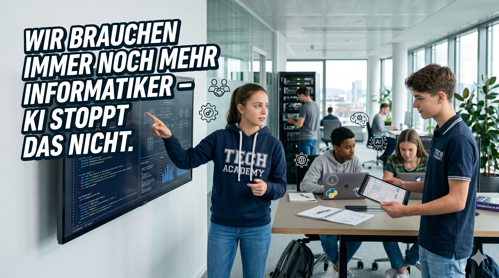

# Wir brauchen immer noch mehr Informatiker – KI stoppt das nicht. 🤖

*Eine persönliche Einschätzung von jemandem, der seit Jahren in der IT-Welt arbeitet – und dessen Söhne genau dorthin wollen.*

Ich habe mich ein wenig mit dem Thema befasst: Braucht es Leute wie mich noch in der Zukunft? Meine Söhne streben eine Karriere in der IT-Welt an – also musste ich mir diese Frage ernsthaft stellen.

**Meine Antwort: JA – aber nicht mehr gleich wie vor 20 Jahren aber as ist ok.** 💡
Wir bauen, Netzwerke, Infrastruktur, KI Infrastructure oder machen erst neue Technologien mit "reasearch" und inovation.

---

## KI ist mächtig – und manchmal ziemlich dumm 🧠

Ja, es stimmt: Anthropic-Modelle und Claude sind beeindruckend. Aber sie können auch sehr dumm sein. Wir haben gesehen, dass ein Compiler generiert werden kann – aber ist er gut? Das weiss man nicht. Es wird nicht erzählt oder getestet; die Headline lautet nur: «Es kann es.»

KI ist ein Tool und kann uns einen enormen Effizienz-Boost geben. Die Frage ist nicht ob, sondern wie wir sie einsetzen.

---

## Was lernt man heute in der Informatik? 🎓

Lernt man in der Informatik immer noch das Gleiche? Und wird gerade dieser Bereich verändert?

Ja, richtig. Lehrer generieren Prüfungen und Schüler nutzen die KI-Tools jeden Tag. Sie sollten damit lernen und nicht nur generieren, sonst bleibt etwas auf der Strecke.

> Also, ihr lernenden Informatiker: Lernt Informatik – und zwar auch die Basics –, sonst wird die Zukunft mit KI vielleicht ein wenig schlechter.

Es gibt verschiedene Theorien, ob KI ab einem gewissen Punkt schlechter oder besser wird. Ich denke, sie lernt aus unserer Vergangenheit – «read the whole internet». Ist alles im Internet korrekt? 🤔

---

## Leadership: Wer verantwortet die Qualität? 🏗️

KI ist definitiv ein Leadership-Thema. Die grossen Tech-Firmen brüsten sich damit, dass KI 70% des Codes schreibt – möglich, aber was nie gezeigt wird, ist der Schrott, der dabei produziert wird.

Die KI ist eine Quasselstrippe – es wird viel Luft generiert. Code sollte nicht 300 Zeilen haben, wenn man ihn mit Intelligenz auf 80 Zeilen bringen kann, die auch noch wartbar sind. Deshalb braucht es den **«Human in the Loop»**: Software-Architekten müssen die Software-Grundlage definieren, um sie wartbar und integrierbar zu machen.

Das können sie, weil sie Erfahrung haben. Wer nie damit gearbeitet oder nie eigene Erfahrungen gemacht hat, kann nicht abschätzen, was richtig oder falsch oder ein schlechtes Design ist.

Wir sollten die KI nutzen, um uns zu helfen, und damit in den Firmen eine Strategie haben, die es erlaubt, mit der gleichen Anzahl an Leuten mehr zu schaffen und daraus zu profitieren. 📈

---

## Es braucht weiterhin Informatiker 💼

Zusammenhänge und komplexe Designs, die integriert werden müssen und Tausende von Kunden betreuen, brauchen uns.

Die grossen Firmen bauen nicht nur Leute ab, weil KI Software schreibt, sondern weil sie das Kapital brauchen. Alphabet, Amazon, Microsoft und Facebook investieren dieses Jahr rund 700 Milliarden Dollar und bauen die nächste Infrastruktur-Generation. Das ist zwar bemerkenswert, gibt aber auch Probleme: Wasser, Strom und Fläche werden gebraucht, und Anleger sind nicht sicher, ob das so erstrebenswert ist. ⚡

Ja, wir sind in einem neuen Zeitalter angekommen – es ist klar ein Meilenstein. 🚀

---

## KI-Müll – AI Slop ist real 🗑️

KI generiert auch viel Mist. Schaut euch YouTube an – KI und Deepfakes sind allgegenwärtig. Wir Menschen müssen einen Fake-Instinkt entwickeln und unseren Kindern beibringen, alles zu hinterfragen. Soziale Medien sind voll von generiertem Unsinn, und das Gleiche gilt für viele Beiträge.

Viel Text, der nichts sagt, ist nicht mehr wert – klingt nur besser. Leider stellen wir Menschen Schönheit immer über Qualität: Manchmal muss es schön sein, aber das allein reicht nicht. 🎨

---

## Science-Fiction – und warum ich entspannt bin 🔮

Ich bin ein Fan von Science-Fiction und die Idee einer Super-Intelligenz klingt spannend … aber ich glaube, wir müssen im Moment keine Angst haben. Fragt man die KI, ob man mit dem Wagen zur 500 m entfernten Waschstrasse fahren soll, wird sie sagen: «Lauf doch, es ist ein kurzer Weg.» 😄

---

## Bin ich ein Fan der KI-Epoche? 🌟

Natürlich – es ist genial, und jeder sollte sich damit befassen. Einige Modelle laufen bereits auf meinem Mobiltelefon: Wie cool ist das denn? Als IT-Nerd bin ich schlicht fasziniert.

Wer schreibt schon gerne Dokumentationen? Ich lasse sie generieren und mache den Qualitäts-Check. Ich experimentiere mit Vibe Coding – das ist sehr spannend. Gespannt bin ich auch auf das Thema «Autonomous Research»; das muss ich unbedingt noch testen. Ich baue KI Agenten und brauche sie für mein daily work. Cool staff...

---

## Key Takeaways ✅

- 🤖 **KI ersetzt keine Informatiker** – sie verändert ihre Rolle. Erfahrung, Urteilsvermögen und Architektur-Kompetenz bleiben unersetzlich.
- 🔧 **KI ist ein Werkzeug, kein Alleskönner** – sie kann enorm produktiv machen, produziert aber auch Schrott. Wer den Unterschied nicht kennt, merkt es nicht.
- 👷 **Human in the Loop ist Pflicht** – Software-Architekten mit echter Erfahrung müssen Qualität, Wartbarkeit und Design sicherstellen, nicht die KI.
- 🎓 **Bildung muss sich anpassen** – KI-Tools gehören in den Unterricht, aber nur als Lernhilfe, nicht als Denk-Ersatz.
- 📈 **Firmen brauchen eine KI-Strategie** – mit gleich vielen Leuten mehr schaffen und diesen Vorteil gezielt nutzen.
- 🧠 **Kritisches Denken wird wichtiger** – Deepfakes, KI-Texte und generierter Unsinn fluten die Medien. Medienkompetenz und ein gesunder Fake-Instinkt sind Pflicht.
- ⚡ **Der Tech-Boom hat seinen Preis** – 700 Milliarden Dollar Infrastruktur-Investitionen bedeuten auch: Mehr Strom-, Wasser- und Flächenverbrauch.

---

*Dieser Text wurde mit KI korrigiert. Geschrieben ist er von mir.* 🙂
