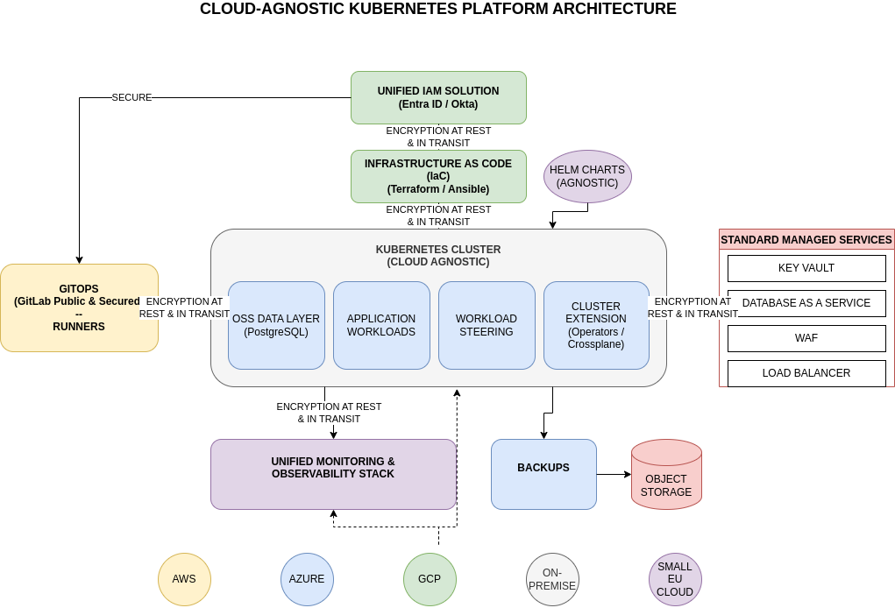

# Cloud Portability: Deploy Anywhere and Scale with Flexibility

⚠️ Disclaimer: This post represents my personal insights and is not affiliated with or endorsed by my current company.

## Introduction

Cloud portability it's a strategic imperative reducing costs, and maintaining deployment flexibility across providers.

The landscape has evolved: while hyperscalers (AWS, Azure, GCP) offer comprehensive services and global reach, European cloud providers deliver 40-75% cost savings with GDPR compliance. The challenge is balancing these trade-offs while maintaining true portability.

This article provides practical strategies and real-world examples for building cloud-agnostic infrastructure using Kubernetes, Infrastructure as Code, and standard APIs—with concrete cost comparisons and deployment patterns that work anywhere.


## The strategy that aligns most closely with my vision.

- Make use of `Infrastructure as Code` (IaC)
- Make use of `Kubernetes` - doesn't matter if it's on-premise, on the top 3 hyperscalers, or small European clouds. Don't build it yourself. Let the hyperscaler work for you.
- Make use of `OSS` (Open Source Software) - for example, using a data layer for databases like `PostgreSQL`, which exists on most platforms
- Make use of `standard managed services` from the cloud resource inventory like Key Vaults, Database as a Service, WAF, Load Balancers - any cloud offers these
- To allow portability, you need to create things like `Helm charts agnostic` to specific cloud providers
- A crucial element is having a `unified monitoring and observability stack`
- `Unified IAM Solution` like Entra ID or Okta
- Build your GitOps (example: GitLab runners) in a way that they can be installed in any cloud or system - GitLab needs to be public and secured.
- Do backups to object storage - with tools like Velero you can move your data where needed
- Use workload steering - define which app should run where based on specific requirements
- Extend the cluster - for example, orchestrate managed databases (roles, etc.) by using an operator or Crossplane
- Add encryption at rest and protect your traffic in transit
- Leverage **spot/preemptible instances** for additional 60-90% savings


## Cloud Service Comparison: Hyperscalers vs smaller European Providers
| Service Category | AWS | Azure | GCP | OVHcloud | Hetzner Cloud |
|-----------------|-----|-------|-----|----------|---------------|
| **Kubernetes** | EKS (Elastic Kubernetes Service) | AKS (Azure Kubernetes Service) | GKE (Google Kubernetes Engine) | Managed Kubernetes Service | Managed Kubernetes |
| **Key Vaults / Secrets** | AWS Secrets Manager / KMS | Azure Key Vault | Secret Manager / Cloud KMS | Secret Manager (Beta) | Not available (use external) |
| **Load Balancers** | ELB, ALB, NLB | Azure Load Balancer / App Gateway | Cloud Load Balancing | Load Balancer | Load Balancer |
| **Global Load Balancers** | CloudFront + Route53 | Azure Front Door / Traffic Manager | Cloud Load Balancing (Global) | Not available | Not available |
| **PostgreSQL** | RDS for PostgreSQL / Aurora PostgreSQL | Azure Database for PostgreSQL | Cloud SQL for PostgreSQL | Public Cloud Databases (PostgreSQL) | Not managed (self-host) |
| **Object Storage** | S3 | Blob Storage | Cloud Storage | Object Storage (S3 compatible) | Not available (use Volumes) |
| **Managed Disks** | EBS (Elastic Block Store) | Managed Disks | Persistent Disk | Block Storage | Volumes |

## Cost Comparison: 3-Node Kubernetes Cluster

**Configuration:**
- 3 worker nodes: 4 vCPU, 16 GB RAM each
- Storage: 300 GB block storage (100 GB per node)
- Object Storage: 1 TB
- Region: EU/US (prices may vary by region)

| Provider | Compute (3 nodes) | Block Storage (300 GB) | Object Storage (1 TB) | **Monthly Total** | **Annual Total** |
|----------|-------------------|------------------------|----------------------|-------------------|------------------|
| **AWS EKS** | ~$270 (t3.xlarge) + $73 (EKS fee) | ~$30 (EBS gp3) | ~$23 (S3 Standard) | **~$396** | **~$4,752** |
| **Azure AKS** | ~$280 (Standard_D4s_v5) + $0 (Free) | ~$36 (Premium SSD) | ~$18 (Blob Storage Hot) | **~$334** | **~$4,008** |
| **GCP GKE** | ~$250 (n2-standard-4) + $73 (GKE fee) | ~$51 (SSD Persistent Disk) | ~$20 (Cloud Storage Standard) | **~$394** | **~$4,728** |
| **OVHcloud** | ~$135 (B2-15) | ~$24 (High Speed) | ~$8 (S3 Object Storage) | **~$167** | **~$2,004** |
| **Hetzner Cloud** | ~$90 (CPX31) | ~$15 (Volumes) | N/A (use Volumes) | **~$105*** | **~$1,260*** |


## GitLab Runner Cost Comparison (Large Build Workload)

**Configuration:**
- Large GitLab Runner: 8 vCPU, 32 GB RAM
- Storage: 200 GB SSD
- Use case: CI/CD pipelines, container builds, test execution
- Running 24/7

| Provider | Instance Type | Monthly Cost | Annual Cost | Notes |
|----------|--------------|--------------|-------------|-------|
| **AWS** | c6i.2xlarge (8 vCPU, 16 GB) | ~$248 | ~$2,976 | Need c6i.4xlarge for 32GB: ~$496/mo |
| **AWS** | c6i.4xlarge (16 vCPU, 32 GB) | ~$496 | ~$5,952 | Compute optimized |
| **Azure** | Standard_D8s_v5 (8 vCPU, 32 GB) | ~$336 | ~$4,032 | Good memory-to-CPU ratio |
| **GCP** | n2-highmem-8 (8 vCPU, 64 GB) | ~$424 | ~$5,088 | More memory than needed |
| **OVHcloud** | B2-30 (8 vCPU, 30 GB) | ~$86 | ~$1,032 | **Best EU value** |
| **Hetzner Cloud** | CCX32 (8 vCPU, 32 GB) | ~$63 | ~$756 | **Cheapest option** |


💡 **Multi-Cloud GitLab Runner Strategy:**
- Deploy runners in **multiple clouds** for redundancy
- Use smaller **European providers** for cost-effective build capacity
- Keep **hyperscaler runners** for specific integrations (AWS ECR, Azure ACR)
- Leverage **spot/preemptible instances** for additional 60-90% savings
- Use **autoscaling** with Kubernetes cluster autoscaler


# An Example could look like this
- AKS + Cilium
- Company add-on for FleetMgmt (ArgoCD, +++)
- Managed Database (flexible DB for PostgreSQL)
- Traffice Manager + Application Gateways + LBs
- Azure Storage account
- GitLab runners where needed on premise, on Azure other places
- Central Monitoring
- SIEM Integration
- Encryption at rest and transit
- Private Network setup
- Bastion




###  HELM chart agnostic example

#### Cloud-Agnostic Ingress/Gateway API Example

**values.yaml** - Platform-specific configuration
```yaml
# values-aws.yaml
ingress:
  enabled: true
  className: alb
  annotations:
    alb.ingress.kubernetes.io/scheme: internet-facing
    alb.ingress.kubernetes.io/target-type: ip
  
# values-azure.yaml
ingress:
  enabled: true
  className: azure-application-gateway
  annotations:
    appgw.ingress.kubernetes.io/use-private-ip: "false"

# values-gcp.yaml
ingress:
  enabled: true
  className: gce
  annotations:
    kubernetes.io/ingress.class: "gce"

# values-onprem.yaml or generic
ingress:
  enabled: true
  className: nginx
  annotations:
    cert-manager.io/cluster-issuer: letsencrypt-prod

# values-openshift.yaml
route:
  enabled: true
  annotations:
    haproxy.router.openshift.io/timeout: 30s
  tls:
    termination: edge
    insecureEdgeTerminationPolicy: Redirect
```


# Key Takeways

* Key Point 1 💡 - Containers help a lot with portability

* Key Point 2 💡 - Combining this thinking with cost awareness, you may start using clouds differently. Run the workload where it makes sense.

* Key Point 3 💡 - Feasibility of adapting multiple stacks is highly dependent on your team and their experience level.

* Key Point 4 💡 - Steer workloads strategically

* Key Point 5 💡 - Make abstraction only where needed. It means more run and maintenance costs.

* Key Point 6 💡 - Make use of managed services where possible.

