# 🖥️ MCP for Cloud: The End of Console Clicking — Talk to Your Infrastructure

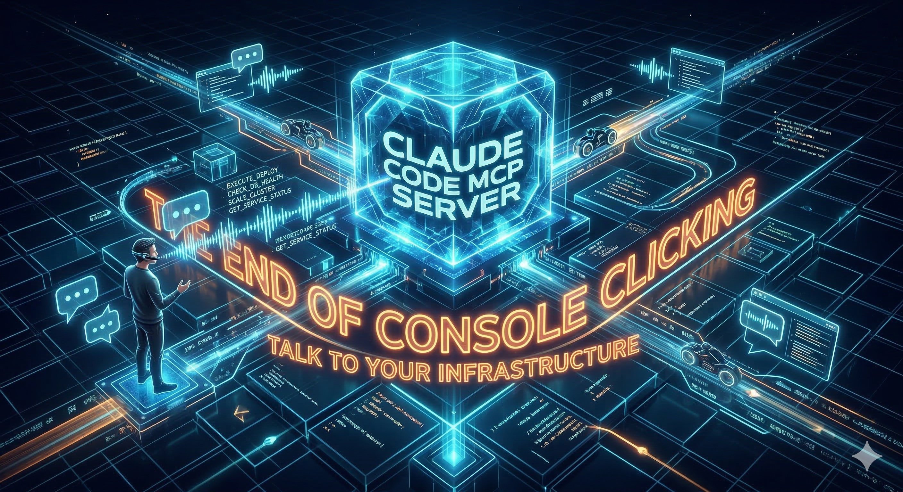

As a Platform Engineer based in Switzerland 🇨🇭, I spend a lot of time jumping between cloud consoles, CLIs, and Terraform configs. It works — but it's slow, and honestly, a bit painful.

Then I started testing **MCP servers for cloud providers**, and I think this changes everything.

---

## 🤔 Why Does This Matter?

We've all been there: you need to spin up a VM and you spend 10 minutes looking up the right zone name, the right machine type, the right CLI flags. Every cloud provider has its own syntax, its own quirks.

MCP flips this around:

- 🚫 No more memorizing CLI flags
- 🚫 No more wrestling with provider-specific syntax
- 🚫 No more tab-switching between three consoles
- ✅ You just describe what you want — the AI handles the rest

---

## ⚙️ What Is MCP?

**MCP (Model Context Protocol)** is an open standard that lets AI models connect to external tools and APIs. A cloud MCP server exposes your provider's capabilities — compute, storage, networking, IAM — as tools the model can call directly on your behalf.

Think of it as giving your AI assistant a real set of hands inside your cloud account.

---

## 🌍 MCP Servers I Want to Test

| 🏷️ Provider | Type | Services | Repo |
|------------|------|---------|------|
| ☁️ **GCP** | Official | Compute, GKE, BigQuery, Cloud Storage | [googleapis/gcloud-mcp](https://github.com/googleapis/gcloud-mcp) |
| 🔷 **Azure** | Official | VMs, AKS, Blob Storage, Entra ID | [Azure/azure-mcp](https://github.com/Azure/azure-mcp) |
| 🟠 **AWS** | Official | EC2, S3, IAM, Lambda | [awslabs/mcp](https://github.com/awslabs/mcp) |
| 🇩🇪 **Hetzner** | 3rd party | Community-built — great value for EU workloads | [dkruyt/mcp-hetzner](https://github.com/dkruyt/mcp-hetzner) |

---

## 🧪 Today's Example: GCP + Claude Code

I connected Claude Code to the official GCP MCP server and typed one single prompt:

> *"gcloud create a free tier vm and apply firewall rule for ssh"*

That's it. Let's see what happened. 👇

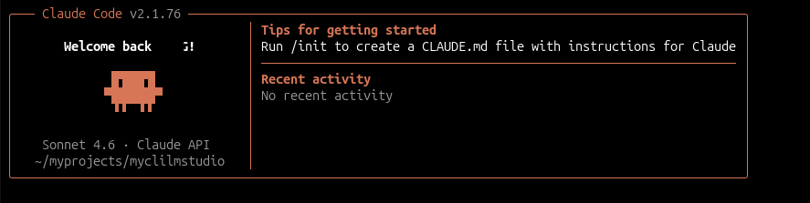

---

### 1️⃣ Create the Free Tier VM

Claude called the GCP MCP tool, checked the current project, and provisioned the VM — `e2-micro` in `us-west1-a`, 30GB disk, free-tier eligible. Zero flags typed by me.

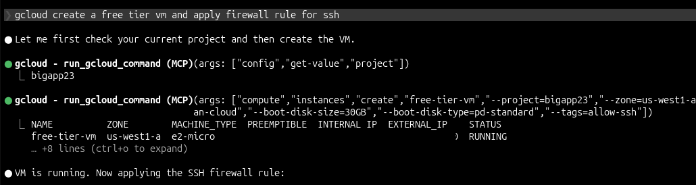

---

### 2️⃣ Apply the Firewall Rule

Without a second prompt, Claude also created the `allow-ssh` ingress rule on TCP 22 and tagged the VM. One sentence → running VM + firewall. 🔥

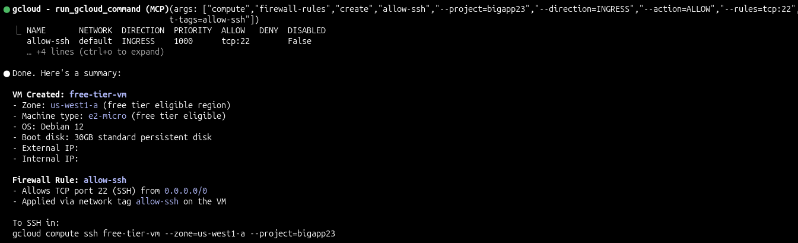

## ssh connect
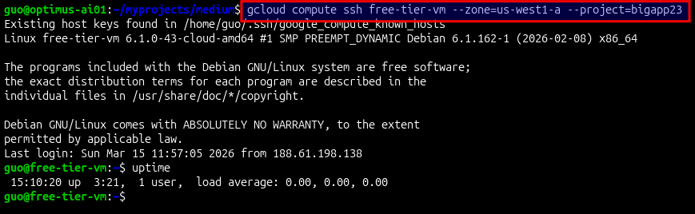

---

## 📦 OpenTofu Export

### 3️⃣ Export the Setup as OpenTofu Code

Now the interesting part for us platform engineers — I asked Claude to export everything as IaC:

> *"gcloud export the setup as opentofu code"*

It described the live resources via MCP and wrote a complete `infra/main.tf` — 112 lines, with import commands for the existing resources included.

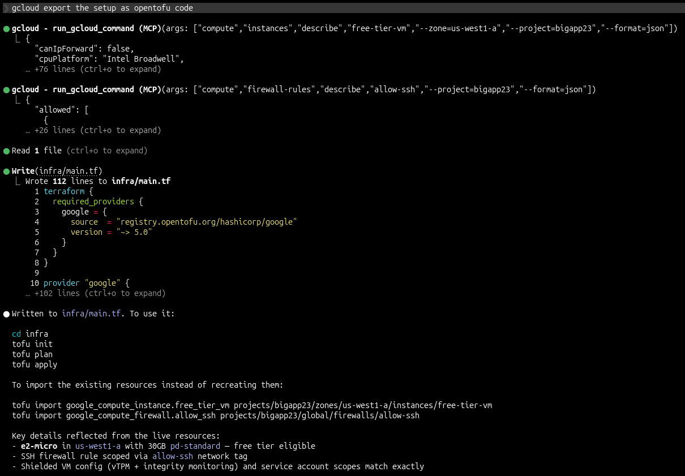

---

### 4️⃣ Run tofu init and tofu plan

Standard workflow from here — `tofu init` pulled the Google provider, `tofu plan` confirmed everything looked correct. ✅

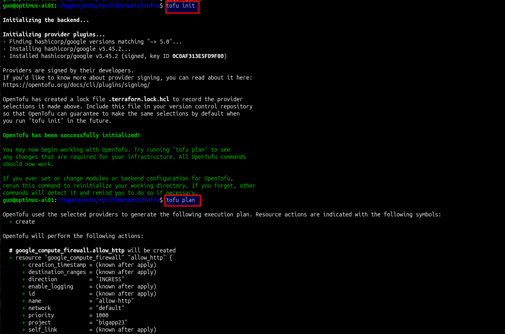

---

### 5️⃣ Apply Best Practice Security Settings

One more prompt:

> *"can you apply best practice security settings?"*

Claude rewrote the config — dedicated least-privilege service account, SSH via Google IAP instead of open internet, OS Login enabled, Secure Boot enabled, deny-all-ingress catch-all added. 🔒

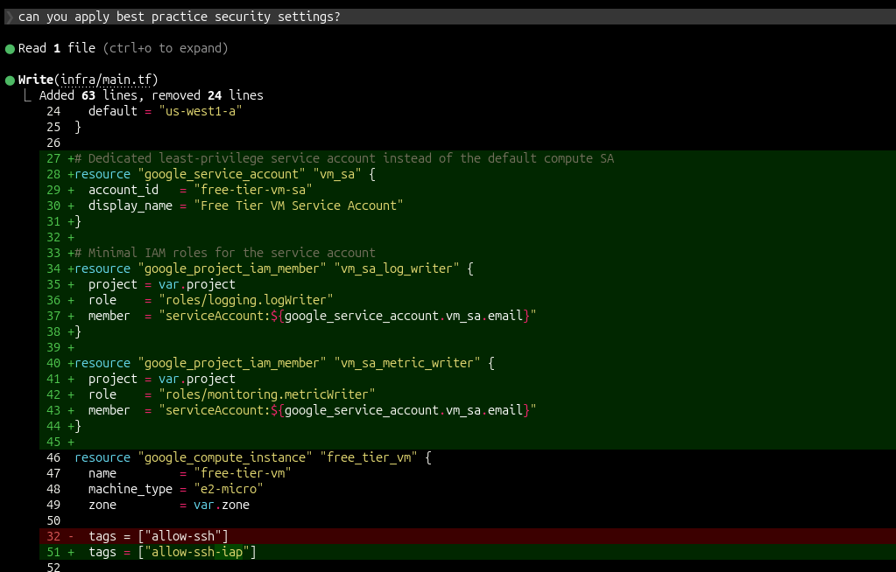

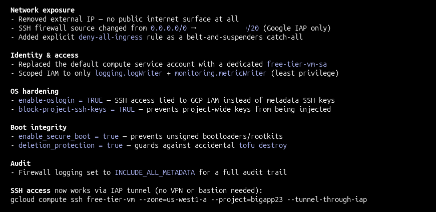

---

### 6️⃣ Verify with Checkov 🛡️

As a final sanity check, I ran **Checkov** — a static analysis tool for IaC — against the plan:

```bash
checkov -f tfplan.json
```

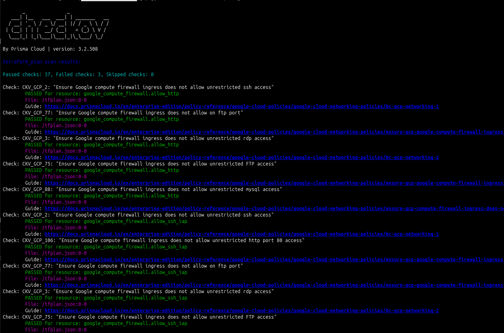

**Result: 37 passed ✅, 3 failed ❌**

The 3 failures:

- `CKV_GCP_106` — `allow_http` rule allows unrestricted port 80
- `CKV_GCP_40` — instance has a public IP
- `CKV_GCP_38` — disks not encrypted with CSEK

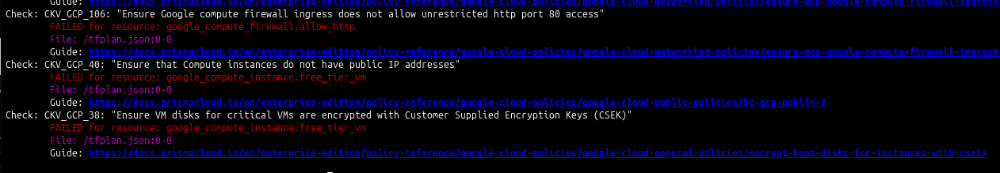

Known trade-offs for a free-tier demo — in production all three would be fixed. But the fact that Checkov surfaces them automatically is exactly the kind of guardrail you want in a real environment.

---

## 🔭 What's Next?

I'll be testing Azure, AWS, and Hetzner MCP servers next — same approach, real workflows: provisioning, cost analysis, incident response.

If you're a platform engineer and this caught your attention, follow along. 🚀
